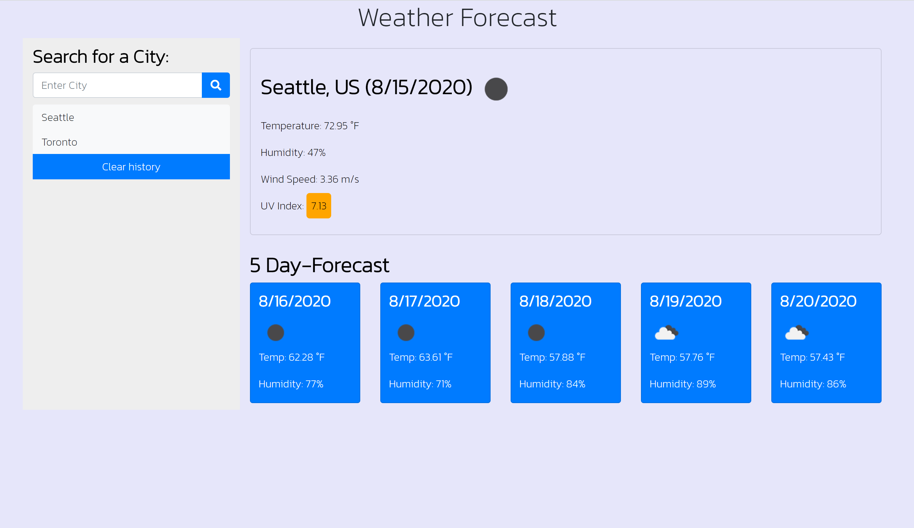

# Weather_Dashboard

## Table of contents

- [General info](#general-info)
- [Technologies](#Technologies)
- [Summary](#Summary)
- [Author](#Author)
- [License](#License)

## General info

5 day forecast created with Open Weather Maps

This project utilizes HTML, CSS, JAVASCRIPT, jQuery, & AJAX

## Technologies

Project is created with:

- [OPENWEATHERMAPS](https://openweathermap.org/)
- [JavaScript](https://www.javascript.com/)
- [Bootstrap](https://getbootstrap.com/)
- [AJAX](https://api.jquery.com/jquery.ajax/)

## Summary

- This project is a 5 Day Weather Forecast a user can use with their own API key. I hid my own API key but if you plug in your own key your results should match the screenshot. A user can get a free API key by creating a free account with Open Weather Maps.

## Author

- Cheyenne Hunt 

## License

- Open Source
- Created for the University of Washington Code-Boot Camp 2020: Homework 